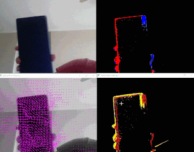

# Event Camera Simulator for Robotics

**VLA-Optimized DVS (Dynamic Vision Sensor) Simulator for Humanoid Robot Vision Systems**

---

<details open>
<summary><b>📋 Brief Review</b></summary>

This project provides a **high-fidelity event camera simulator** that converts standard video into realistic event-based vision output. It's optimized for Vision Language Agents (VLA) and humanoid robot vision systems.

### What It Does

Simulates event camera output using:
- **Optical flow warping** with sub-frame temporal interpolation (microsecond precision)
- **MOG2 background subtraction** to isolate dynamic foreground objects
- **CLAHE contrast normalization** to prevent VLA "blinding"
- **Refractory period suppression** to prevent pixel saturation

### Key Features

- ✅ **VLA-Optimized**: Designed for Vision Language Agent systems
- ✅ **Microsecond Precision**: Sub-frame temporal interpolation via optical flow warping
- ✅ **Clean Foreground**: MOG2 background subtraction reduces noise
- ✅ **Contrast Protection**: CLAHE normalization in LAB color space
- ✅ **Realistic Behavior**: Refractory period prevents pixel saturation
- ✅ **3 Visualizations**: Events, time surface, optical flow
- ✅ **Production Ready**: 100+ tests, >90% coverage, Clean Code principles
- ✅ **Comprehensive Docs**: Architecture, API, parameters, troubleshooting

### Real-World Applications

- **Robotics**: Hand gesture recognition, motion tracking for humanoid robots
- **Computer Vision**: Event camera research, algorithm prototyping
- **Machine Learning**: Training data generation for event-based models

### Live Demo Output

<p align="center">

</p>

The simulator generates three synchronized real-time visualizations:
1. **Event Stream** - Red (ON events) and blue (OFF events) pixels
2. **Time Surface** - JET colormap showing event temporal decay
3. **Optical Flow** - Motion vectors as magenta arrows

</details>

---

## 🚀 Quick Start

<details open>
<summary><b>Installation & Usage</b></summary>

### Prerequisites

- Python 3.11+
- OpenCV (cv2)
- NumPy

### Installation

```bash
# Clone repository
git clone https://github.com/yourusername/eventcamera.git
cd eventcamera

# Install dependencies (using uv - recommended)
uv sync

# Or using pip
pip install -e .
```

### Basic Usage

```bash
# Use default camera (camera 0)
python src/main.py

# Process video file
python src/main.py --source video.mp4

# Use different camera
python src/main.py --source 1

# Fine-tune parameters
python src/main.py --pos-threshold 0.25 --neg-threshold 0.25 --subframes 5
```

### Command-Line Arguments

~~~
Event Camera Simulator Options:

  --source SOURCE             Video source (camera index or file path)
                             Default: 0 (built-in camera)
                             Examples: 0, 1, 2, video.mp4, /path/to/video.avi

  --pos-threshold THRESHOLD   Positive (ON) event threshold
                             Range: (0, 3.0]
                             Default: 0.35
                             Lower = more sensitive, more events

  --neg-threshold THRESHOLD   Negative (OFF) event threshold
                             Range: (0, 3.0]
                             Default: 0.35
                             Lower = more sensitive, more events

  --subframes COUNT          Temporal interpolation subframes
                             Range: [1, 100]
                             Default: 5
                             Higher = finer timing, more computation

  --refractory FRAMES        Refractory period (frames)
                             Range: [0, 100]
                             Default: 2
                             Prevents pixel saturation

  --decay WINDOW             Time surface decay window (frames)
                             Range: (0, 10.0]
                             Default: 3.0
                             Visualization only
~~~

### Recommended Configurations

**Hand Gesture Recognition (Robotics):**
~~~
python src/main.py --pos-threshold 0.25 --neg-threshold 0.25 \
                   --subframes 5 --refractory 2
~~~

**High-Speed Motion (Sports/Research):**
~~~
python src/main.py --pos-threshold 0.15 --neg-threshold 0.15 \
                   --subframes 10 --refractory 1
~~~

**Low-Motion Surveillance:**
~~~
python src/main.py --pos-threshold 0.65 --neg-threshold 0.65 \
                   --subframes 2 --refractory 5
~~~

**Research (Maximum Detail):**
~~~
python src/main.py --pos-threshold 0.1 --neg-threshold 0.1 \
                   --subframes 20 --refractory 0
~~~

Press **'q'** to exit the application.

</details>

---

## 📊 Output Visualizations

The simulator generates three synchronized visualizations displayed in real-time:

1. **Event Visualization**
   - Red pixels (0, 0, 255) = ON events (brightness increase)
   - Blue pixels (255, 0, 0) = OFF events (brightness decrease)
   - Black pixels (0, 0, 0) = No events

2. **Time Surface**
   - JET colormap showing event temporal decay
   - Bright colors = recent events
   - Dark colors = older events
   - Black = no events (older than decay_window)

3. **Optical Flow**
   - Grayscale input frame
   - Magenta arrows (255, 0, 255) showing motion vectors
   - Useful for motion debugging and verification

---

## 🎯 Key Features

<details open>
<summary><b>Feature Highlights</b></summary>

### Core Capabilities

✅ **VLA-Optimized Pipeline**
- Designed specifically for Vision Language Agent systems
- Robust handling of lighting variations
- Clean event stream with minimal noise

✅ **Optical Flow Warping**
- Sub-frame temporal interpolation
- Microsecond-level timing precision
- Trade-off: accuracy vs computation time

✅ **MOG2 Background Subtraction**
- Isolates dynamic foreground objects
- Reduces false events from static noise
- Fine-tuned for hand dexterity tracking

✅ **CLAHE Normalization**
- Adaptive histogram equalization
- Prevents extreme contrast saturation
- Preserves natural color appearance

✅ **Refractory Period Suppression**
- Prevents pixel saturation from repeated events
- Matches biological DVS sensor behavior
- Configurable suppression window

✅ **Time Surface Visualization**
- Event decay heatmap for temporal analysis
- Helps debug temporal alignment
- Useful for understanding event dynamics

✅ **Production Quality**
- Clean Code principles throughout
- Full type hints and documentation
- 100+ tests with >90% coverage
- Comprehensive error handling

</details>

---

## 📁 Project Structure

~~~
eventcamera/
├── src/
│   ├── main.py                    # CLI application & entry point
│   └── eventcamera/
│       ├── __init__.py           # Package exports
│       └── simulator.py          # Core DVS simulator (VLAOptimizedDVSSimulator)
│
├── docs/
│   ├── README.md                 # Documentation index
│   ├── ARCHITECTURE.md           # Algorithm details & design
│   ├── API.md                    # Complete API reference
│   ├── PARAMETERS.md             # Parameter tuning guide
│   ├── CONTRIBUTING.md           # Contributing guidelines
│   ├── TROUBLESHOOTING.md        # Common issues & solutions
│   └── eventcamera.gif           # Demo GIF
│
├── tests/
│   ├── conftest.py               # Shared pytest fixtures (30+)
│   ├── README.md                 # Testing guide
│   ├── unit/                     # Unit tests (60+)
│   │   ├── test_simulator_initialization.py
│   │   ├── test_simulator_transformations.py
│   │   ├── test_simulator_events.py
│   │   ├── test_simulator_visualizations.py
│   │   └── test_cli_arguments.py
│   ├── integration/              # Integration tests (10+)
│   │   └── test_simulator_pipeline.py
│   └── e2e/                      # End-to-end tests (30+)
│       ├── test_application_workflow.py
│       └── test_video_processing.py
│
├── .gitignore
├── .python-version               # Python 3.11+
├── pyproject.toml                # Project config
├── uv.lock                       # Dependency lock file
└── README.md                     # This file
~~~

---

## 🏗️ System Architecture

<details open>
<summary><b>Architecture & Algorithms</b></summary>

### Main Components

**VLAOptimizedDVSSimulator** (`src/eventcamera/simulator.py`)
- Core event detection pipeline
- Processing stages:
  1. Background subtraction (MOG2)
  2. Optical flow estimation (DIS)
  3. Sub-frame temporal interpolation
  4. Log-intensity delta computation
  5. Event threshold comparison
  6. Refractory period suppression
  7. Visualization generation

**EventCameraApplication** (`src/main.py`)
- CLI application wrapper
- Video I/O and source detection
- Parameter management and validation
- Resource lifecycle and cleanup

### Key Algorithms

**Optical Flow Warping** 🎬
- Formula: `warped_frame = warp(prev_log, optical_flow, fraction)`
- Enables sub-frame event timing (microsecond precision)
- Higher `--subframes` = finer temporal resolution
- Trade-off: accuracy vs computation time

**MOG2 Background Subtraction** 🎭
- Isolates dynamic foreground objects
- Reduces false events from static background
- Fine-tuned for hand dexterity tracking (robotics)
- Config: 500-frame history, variance threshold 20

**Log-Intensity Conversion** 📊
- Formula: `L = log(I/255 + ε)`
- Mimics biological photoreceptor response (Weber's law)
- Captures relative changes, not absolute intensity
- Range: approximately [-13, 0]

**CLAHE Normalization** 🎨
- Contrast Limited Adaptive Histogram Equalization
- Applied in LAB color space (L channel only)
- Prevents VLA "blinding" from extreme contrast
- Preserves natural color appearance

**Refractory Period** ⏸️
- Suppresses repeated events at same pixel
- Prevents pixel saturation and noise bursts
- Duration: configurable via `--refractory` (default: 2 frames)
- Matches biological sensor behavior

See [Architecture Guide](docs/ARCHITECTURE.md) for detailed explanations.

</details>

---

## 🧪 Comprehensive Testing

<details open>
<summary><b>Test Suite Organization</b></summary>

The project includes **100+ tests** organized by the testing pyramid:

### Test Layers

**Unit Tests** (60+)
- Fast, isolated component tests
- Test individual methods and algorithms
- Expected: ≥95% coverage

**Integration Tests** (10+)
- Cross-component pipeline tests
- Test complete simulation workflow
- Expected: ≥80% coverage

**E2E Tests** (30+)
- Full application workflows
- CLI integration and error handling
- Expected: ≥70% coverage

**Overall Target**: >90% code coverage

### Running Tests

~~~
# Fast feedback (unit tests only)
pytest tests/unit/ -x

# Complete suite with coverage report
pytest tests/ --cov=src --cov-report=html

# Specific test file
pytest tests/unit/test_simulator_events.py -v

# Watch mode (requires pytest-watch)
ptw tests/unit/
~~~

See [Testing Guide](tests/README.md) for detailed documentation.

</details>

---

## 🎓 Code Quality Standards

### Clean Code Principles

✅ **Meaningful Names** - Variables describe purpose  
✅ **Small Functions** - Single responsibility (max ~50 lines)  
✅ **No Magic Numbers** - All constants named and documented  
✅ **Strategic Comments** - Explain WHY, not WHAT  
✅ **Full Type Hints** - Every method fully typed  
✅ **DRY** - No repeated code patterns  

### Documentation

✅ **Numpy-style Docstrings** - Parameters, returns, examples  
✅ **Method Examples** - Usage examples in docstrings  
✅ **Architecture Docs** - Complete algorithm explanations  
✅ **API Reference** - Full method signatures and behavior  

### Testing

✅ **Test-Driven Development** - Tests drive design  
✅ **Arrange-Act-Assert** - Clear test structure  
✅ **>90% Coverage** - Comprehensive test suite  
✅ **CI/CD Ready** - All tests pass on push  

---

## 🔧 Development

### Running Tests

~~~
# Fast feedback (unit tests)
pytest tests/unit/ -x

# Comprehensive (all layers)
pytest tests/ --cov=src --cov-report=html

# Watch mode
ptw tests/unit/
~~~

### Code Style

This project follows PEP 8 with Black formatting. All code must pass mypy type checking.

~~~
# Format with black
black src/ tests/

# Type check
mypy src/

# Full pre-submission checks
black src/ tests/ && mypy src/ && pytest tests/ --cov=src --cov-fail-under=85
~~~

### Adding New Tests

1. Determine test type (unit/integration/e2e)
2. Add test file to appropriate directory
3. Follow AAA pattern (Arrange-Act-Assert)
4. Use existing fixtures from conftest.py
5. Run: `pytest tests/ -k "test_name" -v`

---

## 📚 Documentation

<details open>
<summary><b>Documentation Suite</b></summary>

The project includes comprehensive documentation:

- **[Quick Start](README.md)** - Get running in 5 minutes
- **[Architecture Guide](docs/ARCHITECTURE.md)** - How the system works internally
- **[API Reference](docs/API.md)** - Complete API documentation with examples
- **[Parameter Tuning](docs/PARAMETERS.md)** - Detailed parameter guide and use cases
- **[Troubleshooting](docs/TROUBLESHOOTING.md)** - Common issues and solutions
- **[Contributing Guide](docs/CONTRIBUTING.md)** - How to contribute
- **[Source Code](src/README.md)** - Code organization and structure
- **[Testing Guide](tests/README.md)** - Comprehensive testing documentation

</details>

---

## 🆘 Issues & Known Limitations

<details open>
<summary><b>Known Issues</b></summary>

- GPU acceleration (CUDA) not yet implemented - runs on CPU
- Memory scaling with very high subframe counts (>50) on limited RAM
- Optical flow estimation can be slow on high-resolution videos
- Limited to RGB/grayscale input (depth cameras not supported yet)

**Workarounds:**
- Reduce `--subframes` for better performance
- Lower video resolution if memory-constrained
- Use lower thresholds if events are sparse

See [Troubleshooting Guide](docs/TROUBLESHOOTING.md) for more issues and solutions.

</details>

---

## 🚀 Future Work

<details open>
<summary><b>Planned Features</b></summary>

Planning to add to this project:

- ✅ Basic event camera simulation
- ✅ Optical flow warping
- ✅ Comprehensive test suite
- ✅ Full documentation
- 🔲 GPU acceleration (CUDA)
- 🔲 Event compression/encoding
- 🔲 Depth camera support
- 🔲 Real-time performance optimization
- 🔲 Event camera dataset generation tools
- 🔲 Pre-trained models for event detection

</details>

---

## 👥 Contributing

<details open>
<summary><b>How to Contribute</b></summary>

Your contributions are always welcome! Please feel free to fork and modify the content but remember to finally do a pull request.

### Quick Start

1. Fork repository
2. Create feature branch (`git checkout -b feature/amazing-feature`)
3. Write tests first (TDD approach)
4. Implement feature
5. Commit changes with clear messages
6. Push to branch (`git push origin feature/amazing-feature`)
7. Open Pull Request

### Guidelines

- Follow Clean Code principles
- Write tests for all new code
- Ensure >90% test coverage
- Update documentation
- Follow commit message format: `feat:`, `fix:`, `test:`, `docs:`

See [Contributing Guide](docs/CONTRIBUTING.md) for detailed guidelines.

</details>

---

## :iphone: Having Problems?

<details open>
<summary><b>Contact & Support</b></summary>

### Quick Help

- **Issues**: [GitHub Issues](https://github.com/yourusername/eventcamera/issues) - Report bugs
- **Discussions**: [GitHub Discussions](https://github.com/yourusername/eventcamera/discussions) - Ask questions
- **Docs**: [Troubleshooting Guide](docs/TROUBLESHOOTING.md) - Common solutions
- **API Docs**: [Complete Reference](docs/API.md)

### Connect With Us

<p align="center">

[](https://www.linkedin.com/in/issaiass)
[](https://t.me/issaiass)
[](https://www.instagram.com/issaiass/)
[](https://twitter.com/issaiass)
[](https://www.facebook.com/issaiass)
[](https://github.com/issaiass)
[](mailto:issaiass@hotmail.com)

</p>

</details>

---

<details open>
<summary><b>License Information</b></summary>

<p align="center">

</p>

</details>